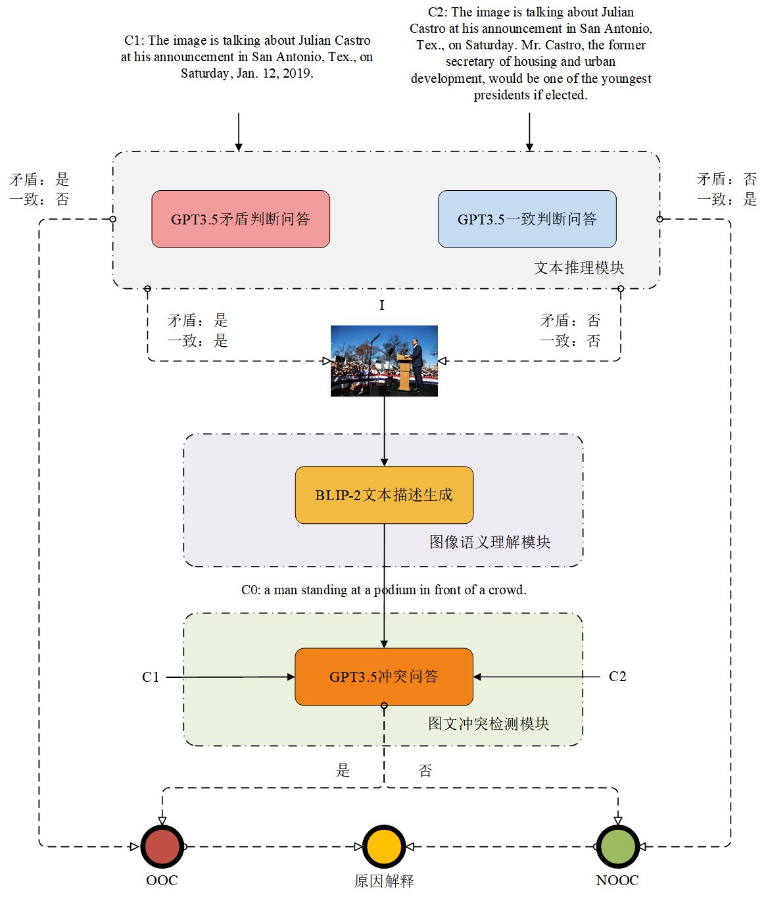

## 基于大语言模型与视觉语言模型的多模态事实核查

本文提出的 **多模态事实核查方法** 如下图所示，包括文本推理、图像语义理解和图文冲突检测三个模块。



### 作者
- 张芃芃<sup>1</sup>
- 彭勃<sup>2*</sup>
- 董晶<sup>2</sup>
- 程皓楠<sup>3</sup>

1.北华航天工业学院遥感信息工程学院，廊坊

2.中国科学院自动化研究所模式识别实验室，北京

3.中国传媒大学媒体融合与传播国家重点实验室，北京

## 摘要
多模态事实核查旨在联合多种模态的媒体内容以抽取有效信息来检测社交媒体背景下的虚假信息。针对已有研究对事实核查领域专用数据集过于依赖以及在图像理解和语义相似度计算方面可解释性弱的问题，提出了一种全新的基于预训练大模型的多模态事实核查自动化方法，并在公开数据集COSMOS上进行了实验。结果表明该方法达到了0.859的正确率，且在每次核查时都能提供清晰的理由，相较于传统的基线方法具有更高的准确性和更强的可解释性。此外，还深入分析了不同的方法变体，以及数据集中各种虚假信息的判别场景，验证了本方法凭借在多模态信息语义理解方面的强大能力，可以灵活应对不同情境下的脱离上下文检测。本文方法为社交网络中多模态媒体内容的事实核查工作提供有力的技术支持和新的思考方向。

## 使用方法

### COSMOS数据集准备
申请并下载[COSMOS数据集](https://github.com/detecting-cheapfakes/detecting-cheapfakes-code)，放入`./res`文件夹下，数据集详细信息可参考文献：

```
Aneja S, Bregler C, Nießner M. Cosmos: Catching out-of-context misinformation with self-supervised learning[J]. arXiv preprint arXiv:2101.06278, 2021.
```

### BLIP-2预训练模型准备
下载[BLIP-2](https://github.com/salesforce/LAVIS/tree/main/projects/blip2)预训练模型并放入`./res/Salesforce/`文件夹下，模型版本为`blip2-flan-t5-xl`，详细信息可参考文献：

```
Li J, Li D, Savarese S, et al. Blip-2: Bootstrapping language-image pre-training with frozen image encoders and large language models[C]//International conference on machine learning. PMLR, 2023: 19730-19742.
```

### OpenAI API Key配置
本程序需要OpenAI API Key调用`gpt-3.5-turbo`模型，参照`main.py`中第13行来配置API Key。
```python
openai.api_key = os.getenv("OPENAI_API_KEY")
```

### COSMOS测试集图像文字描述生成

```bash
python image_understanding.py
```

### COSMOS测试集评估

```bash
python eval_cosmos.py
```

## 引用格式
```
[1]张芃芃,彭勃,董晶,等.基于大语言模型与视觉语言模型的多模态事实核查[J].中国传媒大学学报(自然科学版),2024,31(04):30-37+54.DOI:10.16196/j.cnki.issn.1673-4793.2024.04.002.
```
